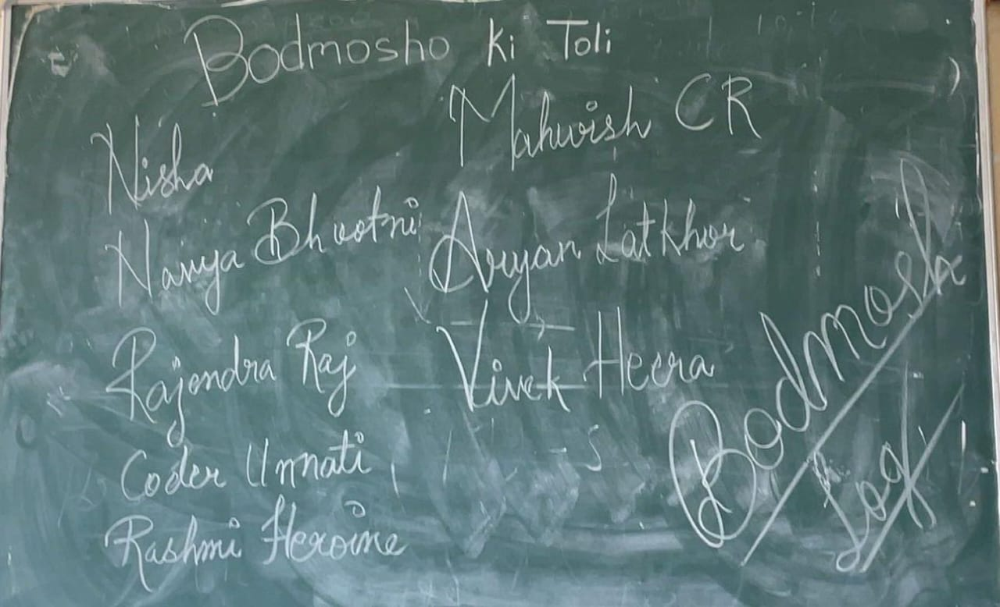

# Welcome to our Web Development Learning Repository! 🚀

## This space is highly dedicated to our <u style="color: #a68a64">Bodmosho Ki Toli</u>. Here, we'll share assets, files, and text documents for assignments to help you build and refine your web development skills.

<h3 style="background-color: #a68a64; color: #fff;  padding: 5px; border-radius: 5px;">Happy coding! 🕸👨🏻‍💻👩🏻‍💻</h3>

  Assignment 1 - <strong><a style="color: #a68a64;" href="https://github.com/icodervivek/bodmosh-webdev/tree/main/assignment_1"><u>Code Files</u></a></strong>  <strong><a style="color: #a68a64;" href="https://icodervivek.github.io/bodmosh-webdev/assignment_1/"><u>Output</u></a></strong>

Assignment 2 - <b><a style="color: #a68a64;" href="https://github.com/icodervivek/bodmosh-webdev/tree/main/assignment_2"><u>Code Files</u></a></b>  <strong><a style="color: #a68a64;" href="https://icodervivek.github.io/bodmosh-webdev/assignment_2/bhootlok"><u>Output</u></a> </strong>

Assignment 3 - <b><a style="color: #a68a64;" href="https://github.com/icodervivek/bodmosh-webdev/tree/main/assignment_3"><u>Code Files</u></a></b>  <strong><a style="color: #a68a64;" href="https://icodervivek.github.io/bodmosh-webdev/assignment_3/"><u>Output</u></a> </strong>

